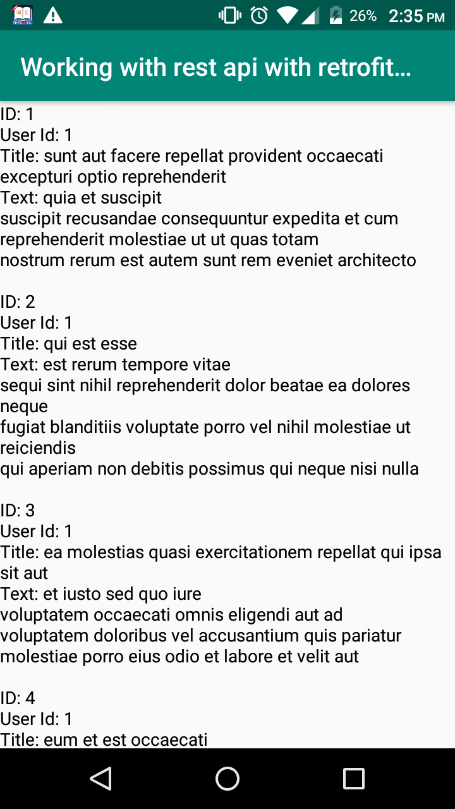
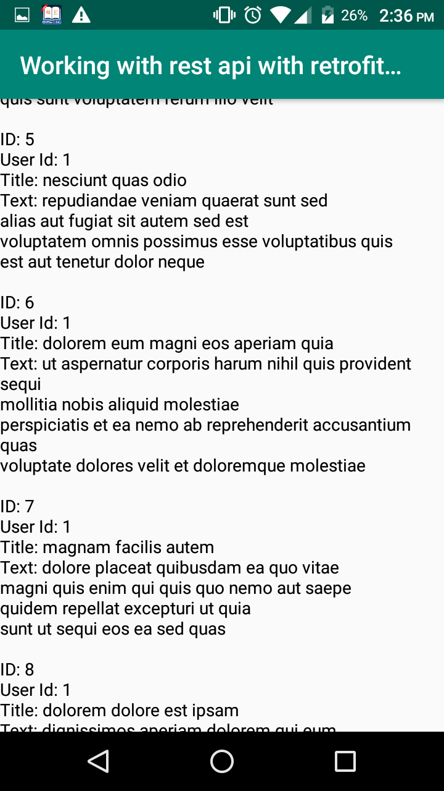

# Rest-Api-using-retrofit-basic-get-method-

we will set up Retrofit in a new Android Studio project by adding the necessary Gradle dependencies, and then already do our first GET request. 
We create an interface with 1 method that we annotate with @GET and the relative URL to the API endpoint of the REST API we want to query. We then create a Retrofit instance, define the baseUrl, add GSON as the converter by passing GsonConverterFactory to the addConverterFactory method, and let Retrofit create the implementation of our API interface at compile time.
The Call object that our GET method returns encapsulates a single request + response. With enqueue we can execute this request asynchcronously on a background thread and get our result back in the onResponse callback. OnFailure will be called if something in the process of communicating with the server or processing the response went wrong. With isSuccessFull we check if our response code is between 200 and 300 and if that's the case we can retrieve our result from the response body.
GSON will parse the array of JSON objects into a List of the Java model class that we prepared beforehand

# Output Image

simple screen 1

simple screen 2

# Required file:
We use two library 

implementation  'com.squareup.retrofit2:converter-gson:2.4.0' 

implementation 'com.squareup.retrofit2:retrofit:2.4.0'

# I learn this library from https://www.youtube.com/playlist?list=PLrnPJCHvNZuBdsuDMl3I-EOEOnCh6JNF3 (youtube playlist) 
